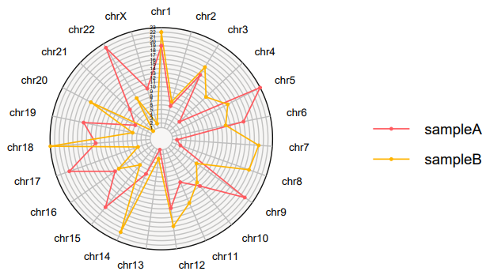

ggradar
================

This `ggradar` is modified from the [ggradar](https://github.com/ricardo-bion/ggradar), which allows you to build radar charts with multiple gridline.

## Install `ggradar`

``` r
devtools::install_github("1156054203/ggradar", 
                          dependencies = TRUE)
```

## Use `ggradar`

``` r
library(ggradar)
library(dplyr)
library(scales)
library(tibble)

set.seed(21)
sampleA <- sample(seq(1,23),size=23)
sampleB <- sample(seq(1,23),size=23)
data <- data.frame(group=c('sampleA','sampleB'),
                   t(data.frame(sampleA=sampleA,sampleB=sampleB)))
chroms <- paste0('chr',c(seq(1:22),'X'))
colnames(data)[-1] <- chroms
```

|        |group   | chr1| chr2| chr3| chr4| chr5| chr6| chr7| chr8| chr9|
|:-------|:-------|----:|----:|----:|----:|----:|----:|----:|----:|----:|
|sampleA |sampleA |   19|    6|   15|    4|   23|   17|    2|    3|   21|
|sampleB |sampleB |   22|    7|   17|   12|   15|   13|   20|   19|    8|


``` r
ggradar2(data,all.radar=seq(1:23),axis.label.size=3.5,grid.label.size=4,group.point.size=1,
         group.line.width=0.6, legend.position='right')
```

{:height="60%" width="60%"}<!-- -->

## Custom config

In addition to `all.radar` and `all.label`, other parameters are consistent with the original package [ggradar](https://github.com/ricardo-bion/ggradar).
Note:
`all.radar`: vector, each value is used to specify the gridline.
`all.label`: vector, each value is used to specify the label for gridline, default is value of `all.radar`.
`gridline.min.linetype`: used to specify gridline style.
`gridline.min.colour`: used to specify gridline colour.
